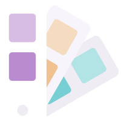
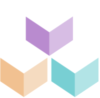

    vds

<h1 class="title has-text-weight-bolder is-family-primary is-hidden-touch is-tight">Vira&nbsp;Design system</h1>
<h1 class="title is-2 has-text-weight-bolder is-family-primary is-hidden-desktop is-tight">Vira Design system</h1>

    Vira Design System is a series of assets and guidelines for building consistent user experiences at Vira. This design system is open-source under a MIT Licence.

    

        <a href="#/content" class="box is-medium has-background-primary-dark is-raised hover-to-popping">
            
            

            <h3 class="title has-text-white is-family-primary has-text-weight-bold is-tight">Foundation</h3>
            
Content, Layout, Color, etc

        </a>
    

    

        <a href="#/avatar" class="box is-medium has-background-primary-gradient is-floating hover-to-popping">
            
            

            <h3 class="title has-text-white is-family-primary has-text-weight-bold is-tight">Components</h3>
            
All you need to build your UIs

        </a>
    

    

        

            <a href="#/CHANGELOG"
               class="is-size-6 has-text-weight-medium is-underlined">Release Notes</a>
        

    

<h3 class="title is-family-primary">Quick start</h3> 

<strong>1 )&nbsp;</strong> Install VDS in your project using the npm package <code>vira-design-system</code>.  

<pre><code>npm install vira-design-system</code></pre>

<strong>2 )&nbsp;</strong> The two files below are enough to start using VDS (fonts must be added seperately).  

<a href="https://raw.githubusercontent.com/Victin09/vira-design-system/master/build/vds.css" class="box is-well" download>→ <strong class="is-monospace">vds.css</strong> <i class="is-dimmed">The only CSS file you'll need to use Vira Design System.</i></a>
<a href="https://raw.githubusercontent.com/Victin09/vira-design-system/master/build/vds-icons.min.svg" class="box is-well" download>→ <strong class="is-monospace">vds-icons.svg</strong> <i class="is-dimmed">An SVG sprite that includes all Vira Design System.</i></a>

<strong>3 )&nbsp;</strong> Read the doc, enjoy VDS. ✌️

    

        

            <h2 class="title is-spaced">Want to <u>contribute?</u></h2>
            
Onboarding for designers and developers wanting to contribute.

        

        

            <a href="#/contribute" class="button is-rounded is-primary is-glowing is-beefy is-medium">Start contributing</a>
            

            Or go straight to our <a href="https://github.com/biings/biings-ds" class="is-underlined">GitHub</a> repo.
        

    

 